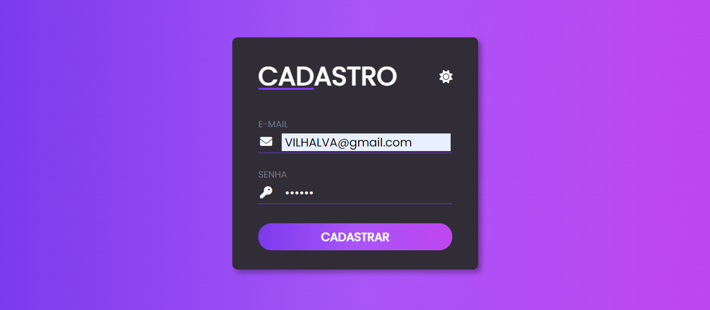
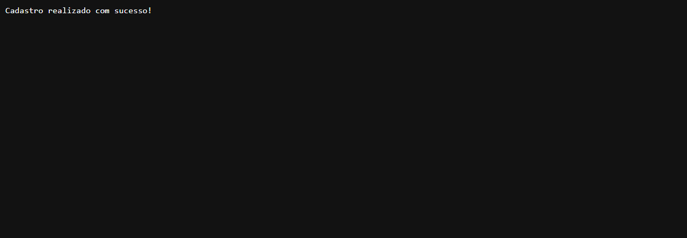
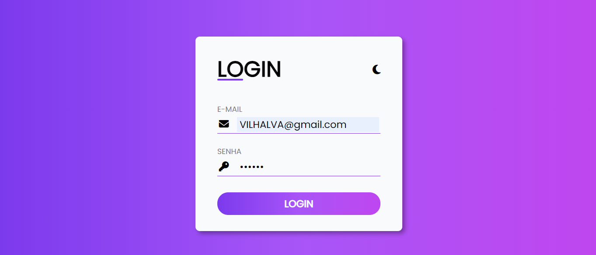
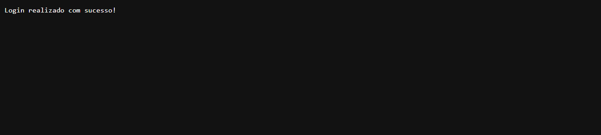
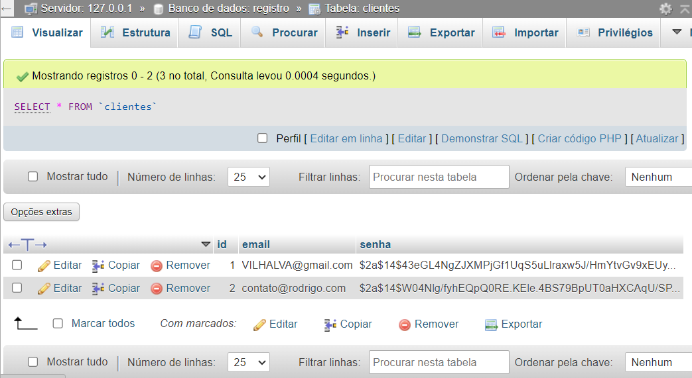

# LOGIN COM GO
👨‍🏫FORMULARIO DE CADASTRO E LOGIN COM TEMA CLARO E ESCURO EM HTML, CSS, JS, GO E MYSQL.

 <br>
 <br>
 <br>
 <br>
 <br>
 <br>

## DESCRIÇÃO:
Este projeto consiste em um sistema de autenticação simples, desenvolvido em **Go** (Golang), com suporte para **cadastro** e **login** de usuários utilizando um banco de dados **MySQL**. A interface é responsiva e conta com um **tema escuro**, utilizando CSS. O sistema inclui:

- **Página de cadastro**: Onde novos usuários podem se cadastrar inserindo seu e-mail e senha.
- **Página de login**: Onde usuários cadastrados podem autenticar suas credenciais.
- **Conexão com MySQL**: O projeto interage com um banco de dados MySQL para armazenar e verificar os dados dos usuários (e-mail e senha).
- **Criptografia de senhas**: As senhas são armazenadas de forma segura no banco de dados, utilizando a biblioteca **bcrypt** para hash.

## FUNCIONALIDADES:
1. **Cadastro de usuário**:
   - Os usuários podem se cadastrar com um e-mail e uma senha.
   - As senhas são criptografadas e salvas no banco de dados.
   - Se um usuário tentar cadastrar um e-mail que já existe, ele será notificado.

2. **Login de usuário**:
   - Usuários podem autenticar suas credenciais na página de login.
   - As senhas enviadas no login são comparadas com os hashes criptografados no banco de dados.
   - Se o login for bem-sucedido, o usuário verá uma mensagem de confirmação.

3. **Design responsivo e tema escuro**:
   - As páginas têm um tema escuro, ajustado para fornecer uma experiência visual agradável.
   - O design é responsivo, o que significa que ele se adapta bem a diferentes tamanhos de tela, incluindo dispositivos móveis.

## EXECUTANDO O PROJETO:
1. **Configuração do Banco de Dados:**
   - Antes de executar o site, é necessário importar o arquivo `./DATABASE/DATABASE.sql` para o seu banco de dados MYSQL.

2. **Configurando suas Credênciais:**
   - Abra o arquivo `./CODIGO/.env` e ajuste as configurações do banco de dados:

     ```env
     DB_USER=seu_usuario            # Substitua pelo seu usuário MySQL
     DB_PASS=sua_senha        # Substitua pela sua senha MySQL
     DB_HOST=127.0.0.1       # Endereço do MySQL
     DB_PORT=3306            # Porta do MySQL
     DB_NAME=registro        # Nome do banco de dados
     ```

3. **Executar o Servidor:**
   - Compile e execute o arquivo `main.go` no diretório `./CODIGO`:
   ```bash
   go run main.go
   ```

   - O servidor estará rodando em [http://localhost:8080](http://localhost:8080).

4. **Usando o sistema:**
   - **Cadastro**:
      - Para realizar um cadastro, clique em **CADASTRO**, preencha o formulário e submeta.
      - Preencha o formulário com um e-mail e senha.
      - Se o e-mail não estiver registrado, o usuário será salvo no banco de dados.
      
   - **Login**:
      - Para realizar o login, clique em **LOGIN**, preencha o formulário e submeta.
      - Informe o e-mail e a senha cadastrados.
      - Se as credenciais estiverem corretas, você verá uma mensagem de sucesso.

   - **Mudando o Tema:**
      - Clicando no ícone, o modo muda e a classe "dark" é adicionada/removida do formulário para alterar o estilo.

## NÃO SABE?
- Entendemos que para manipular arquivos em `HTML`, `CSS` e outras linguagens relacionadas, é necessário possuir conhecimento nessas áreas. Para auxiliar nesse aprendizado, oferecemos cursos gratuitos disponíveis:
* [CURSO DE HTML E CSS](https://github.com/VILHALVA/CURSO-DE-HTML-E-CSS)
* [CURSO DE JAVASCRIPT](https://github.com/VILHALVA/CURSO-DE-JAVASCRIPT)
* [CURSO DE GOLANG](https://github.com/VILHALVA/CURSO-DE-GOLANG)
* [CURSO DE MYSQL](https://github.com/VILHALVA/CURSO-DE-MYSQL)
* [CONFIRA MAIS CURSOS](https://github.com/VILHALVA?tab=repositories&q=+topic:CURSO)

## CREDITOS:
- [PROJETO CRIADO PELO VILHALVA](https://github.com/VILHALVA)
- [A INTERFACE DO FORMULÁRIO FOI BASEADO NO "FORMULARIO DARK"](https://github.com/VILHALVA/FORMULARIO-DARK)


